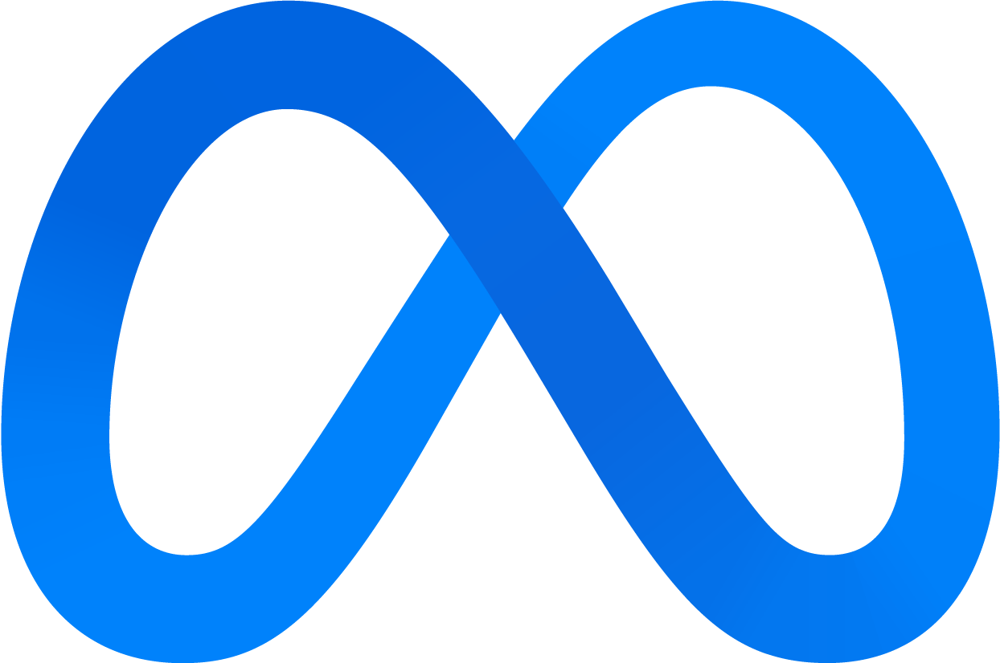

# yo ✌️

i'm a software engineer that is learning to take myself less seriously. lately i've been enjoying
learning colemak and optimizing my vim flow so that i can shave a few nanoseconds off every
keystroke - i'm gonna be lightyears ahead of all these vibe-coders in no time. 

check out all these logos:

  &emsp;&emsp;
  &emsp;&emsp;
  &emsp;&emsp;
  &emsp;&emsp;
  &emsp;&emsp;
  &emsp;&emsp;
  

 

i haven't worked for most of these. but i think it makes my profile look more hirable. the first
logo is mine BTW. i use neovim BTW. i also used to use arch BTW. but now i'm just a normy on a mac
BTW.

my favorite moments in life have been when i knew nothing and learned a skill for the first time.
i'm constantly chasing that. i spend a lot of time training jiu jitsu, writing code, drinking
coffee, and exploring whatever my current obsession of the month is. right now it's split keyboards
and learning to actually touch type.

past flavors have been:
- designing and building guitar pedals
- chess
- learning russian
- playing the spoons
- rewriting my blog with HTMX and Go

future flavors might be:
- building my family a highly available home media k8s cluster
- 3D modeling and aluminum CNC
- learning zig
- youtubing

> in the expert's mind there are few possibilities. in the beginner's &mdash; many.
